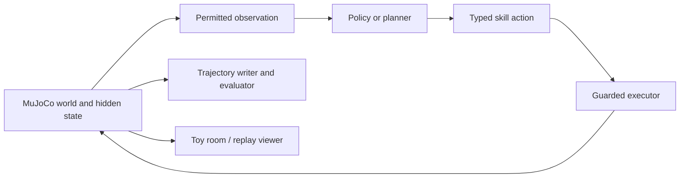

# PRD — Embodied Ecosystem Gym

## Product decision

Embodied Ecosystem Gym is a simulation-first benchmark and data engine with a first-party virtual-toy experience. A small embodied creature sees a partial view of a physical world, maintains internal drives, selects bounded actions, and produces replayable trajectories. The Gym is the source of truth; the toy is the same environment rendered for a human.

The v1 claim is intentionally narrow: a policy can maintain its needs and complete simple grounded tasks under controlled environment variation, and a person can watch or play with the exact policy/world loop.

## User and problem

The initial user is a solo builder or small research team experimenting with compact vision-to-action policies. Existing demos often combine perception, prompting, animation, and one-off scene logic, making them difficult to reproduce, compare, or turn into data. Existing RL tasks commonly omit long-horizon drives, which are what make an agent seem autonomous.

The user needs to answer: “Given only permitted observations and a bounded action interface, can my policy keep an agent alive and accomplish interaction tasks when layouts, distractors, and dynamics change?”

## Goals

- Ship a Gymnasium-compatible, seeded, headless environment with deterministic replay.
- Model egocentric perception, partial observability, simple physics, satiety, energy, boredom, and persistent object state.
- Expose typed, inspectable skills rather than raw joint torques in v1.
- Produce validation-ready trajectory data and fixed-seed evaluation suites.
- Provide scripted, state-oracle RL, and vision-policy baselines.
- Provide a toy/replay viewer that uses the exact same environment API and logs.

## Non-goals

- General-purpose humanoid robotics, real hardware, raw torque control, audio, speech, multiplayer, weather, or a general world model in v1.
- Treating a language model's plausible text as evidence of successful embodiment.
- A frontend that has its own simulation state, rewards, or action outcomes.

## Product surfaces

| Surface | Purpose | Rule |
| --- | --- | --- |
| Headless Gym and benchmark CLI | Train policies, evaluate fixed seed suites, and export trajectories quickly. | Must remain usable without rendering. |
| Virtual toy room and replay viewer | Watch a live policy, issue an allowed task request, inspect drives/outcomes, and replay runs. | Calls the same `reset`, `step`, action executor, and logger as the Gym. |

## Environment contract

```python
env = EcosystemEnv(config=EcosystemConfig(seed=7, observation_mode="rgb"))
observation, info = env.reset(seed=7)
observation, reward, terminated, truncated, info = env.step(
    SkillAction(name="walk_to", target=NormalizedTarget(x=0.4, y=-0.2))
)
```

Observation modes:

- `state_oracle`: privileged state for debugging and fast baseline RL only.
- `hybrid`: RGB plus non-privileged detected-object data, to isolate perception failures.
- `rgb`: egocentric camera, normalized drives, and prior action outcome only. Camera-control state stays out of the observation; a policy can retain only its own action history.

V1 actions and results:

| Action | Parameters | Outcome |
| --- | --- | --- |
| `walk_to` | target XY, speed | Navigate toward an accessible position. |
| `pick_up` | object selector or local target | Attempt a guarded grasp. |
| `consume` | held object | Eat an edible object and restore satiety. |
| `place` | target XY | Put a held object down. |
| `run_around` | duration, radius | Explore/play while consuming energy. |
| `idle` | duration | Advance time without acting. |
| `scan` | duration | Advance the agent-mounted RGB camera to its next public camera sector. |
| `pick_up_relative` | local RGB-relative target | Attempt pickup of the visible candidate at a local offset; a blocked distractor returns `blocked`. |

Each action returns `success`, `blocked`, `target_not_visible`, `not_holding_object`, `not_edible`, or `timeout`. The environment must never repair a failure invisibly.

## Tasks

1. **Find and eat:** low satiety; locate, pick up, and consume food before the survival horizon.
2. **Play when bored:** locate and manipulate a toy after boredom crosses a threshold.
3. **Choose the reachable item:** select food that is reachable rather than a blocked distractor.
4. **Recover after disturbance:** observe, replan, and finish after an object moves mid-action.
5. **Competing drives:** prioritise survival over play when both drives are active.
6. **Generalization:** evaluate held-out layouts, textures, object identities, camera poses, friction, and spawn locations.

## Reward and termination

Keep sparse success and shaping separate in all reports.

- `+1.0` completed task transition.
- `-0.01` per simulated second.
- `-0.1` predictable invalid action or collision.
- `-1.0` satiety or energy reaches zero; terminate.
- `+0.05` correct recovery action after a detected disturbance.

Terminate on task completion, drive depletion, time limit, or unrecoverable simulator failure. Reward configuration is versioned and shared across all task implementations.

## Data and evaluation

Log one versioned JSONL record per environment step and place frames/videos at content-addressed paths. Store privileged debug state separately from policy-visible inputs.

```json
{"schema_version":"0.1","episode_id":"find-eat_seed-0007_run-01","step":42,"seed":7,"observation_ref":"frames/sha256-...png","action":{"name":"pick_up","target_object_id":"berry-2"},"outcome":"success","reward":0.02,"terminated":false,"environment_version":"0.1.0"}
```

Release criteria:

- Same seed and action trace have identical outcomes across 20 replays.
- All six tasks have tests and at least 20 fixed evaluation seeds.
- A scripted policy exceeds 95% success in-distribution.
- A state-oracle policy materially beats random on Find and eat.
- Oracle, hybrid, and RGB-only results are distinct reports.
- Every logged trajectory validates and replays without missing assets.
- Sequential RGB recovery uses a frozen 20-seed protocol with named adverse conditions, binomial confidence intervals, and a separately labeled state-oracle ceiling.

## Technical approach

Start with custom MuJoCo + Gymnasium. The benchmark's drive/task loop is the contribution, so it should be simple to inspect and work on an ordinary development machine. Use deterministic guarded controllers beneath the skill API. Start with local JSONL plus content-addressed frames; export to an interoperable episodic format later if offline RL or sharing becomes a real need.

Use ManiSkill if GPU-parallel visual data collection and its manipulation/VLA baselines become more important than full simulator control. Use Habitat-Lab for photorealistic indoor navigation, Isaac Lab for established NVIDIA GPU-scale robotics infrastructure, and PettingZoo only once multiple creatures genuinely require multi-agent interactions.

## Architecture



## Risks

- “Ecosystem” can become vague, so v1 is one creature, a few resources, and one room.
- High-level skills can hide difficulty, so publish the action contract and retain a future lower-level control track.
- Rendering can bottleneck iteration, so preserve a headless oracle mode.
- Reward hacking is likely, so success checks inspect world state, not animation completion or proximity alone.
- The viewer can turn this into a pretty demo, so fixed-seed replay and baseline tables are required before frontend polish.
